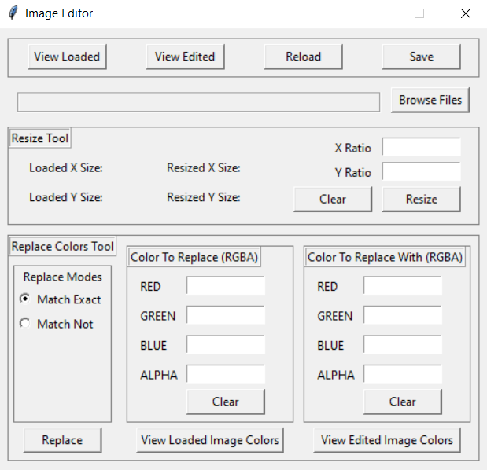

# Image Resizer and Color Replacer

Simple GUI that allows for the resizing of various image formats, and adding and removing colors from images
Intially built to edit thumbnails for a [calculator project](https://github.com/Pectacius/Calculus-Matrix-Calculator)



## Description
A tkinter GUI that uses pillow to:
- resize images based on input length and width ratios
- replace specific pixel colors with another color

#### Supported Image Formats

Currently, the file search function filters, and the file save options are:
 - `.bmp`
 - `.jpg / .jpeg`
 - `.png`
 - `.svg`
 - `.tiff`
 
 Pillow can support more formats, so feel free to add more file formats to the `valid_file_types` tuple in `main.py`:
 
 ```
valid_file_types = (("Bitmap files", "*.bmp*"),
                        ("JPEG files", "*.jpg*"),
                        ("PNG files", "*.png*"),
                        ("SVG files", "*.svg*"),
                        ("TIFF files", "*.tiff*"))
```

## Setup
1. Clone repository and run `pipenv sync` to install dependencies in new environment
2. run `main.py`

## Usage
#### General


- `Browse Files` allows an image file to be selected
- `View Loaded` opens the selected image in default image viewer
- Preview the resized image in default image viewer with `View Edited`
- `Reload` removes all changes to edited image. Equivalent to using `Browse Files` again, removes the need to select the file again ;)
- Save the edited image with `Save`

#### Resize Tool


- Type x and y resize ratios in the boxes for `X Ratio` and `Y Ratio` respectively (i.e. to halve the size of the width type `0.5` in `X Ratio`)
- Press `Resize` to apply the ratios to the loaded image
- `Loaded X Size`, `Loaded Y Size`, `Resized X Size` and `Resized Y Size` displays the pixels of the loaded and edited image respectively (Helps you make judgements on picking resize ratios)
- `Clear` is a little macro to remove all inputs in the resize ratio boxes

#### Replace Color Tool


- `Replace Modes` shows the available color replacement modes
  - `Match Exact` replaces only the specified RGBA color in the `Color To Replace` box with the specified RGBA color in the `Color To Replace With` box
  - `Match Not` replaces all colors but the specified RGBA color in the `Color to Replace` box with the specified RGBA color in the `Color to Replace With` box
- Similarly the `Clear` is a little macro to remove all color values in the color box
- `Replace` will apply the specified changes to the image
- `View Loaded Image Colors` and `View Edited Image Colors` will show a popup of all the unique colors and their RGBA values of the loaded and edited image respectively, this should help with finding the exact color to replace ;)

#### Example
The background of this image is transparent


It can be easily set to any color one likes (i.e. black)

Looking at the table of all the colors in the picture


One must replace `(230,230,230,255)` and `(255,255,255,255)` with `(0,0,0,255)`, which produces


This tool is very nice to change background colors and transparencies!

### Note
#### Can't Find Your Image?


Use the dropdown to change the type of file being searched when selecting an image to be opened

#### Which File Is Edited?

If there is an existing `Edited File` (you can check by clicking on `View Edited`), the modifications are on that image, else the modifications are performed on the `Loaded File` and the changes are stored as the `Edited File`
